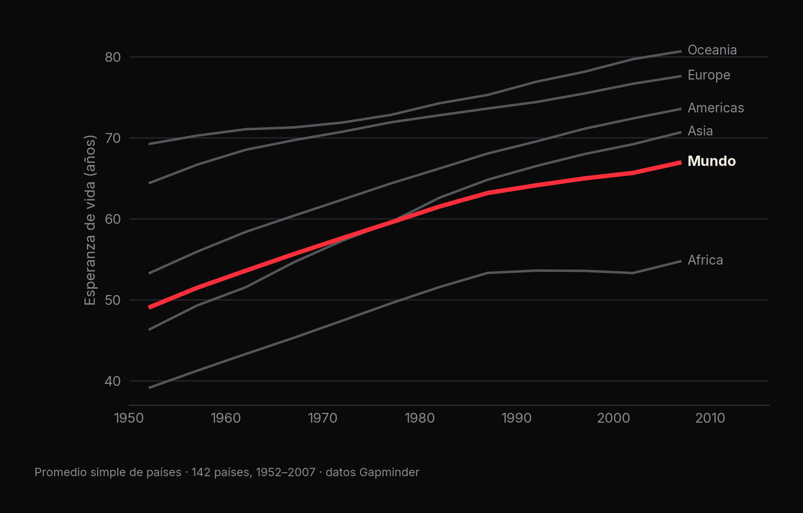
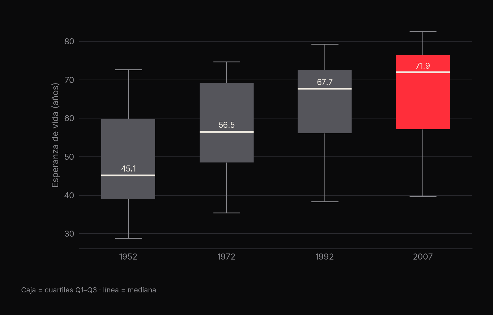
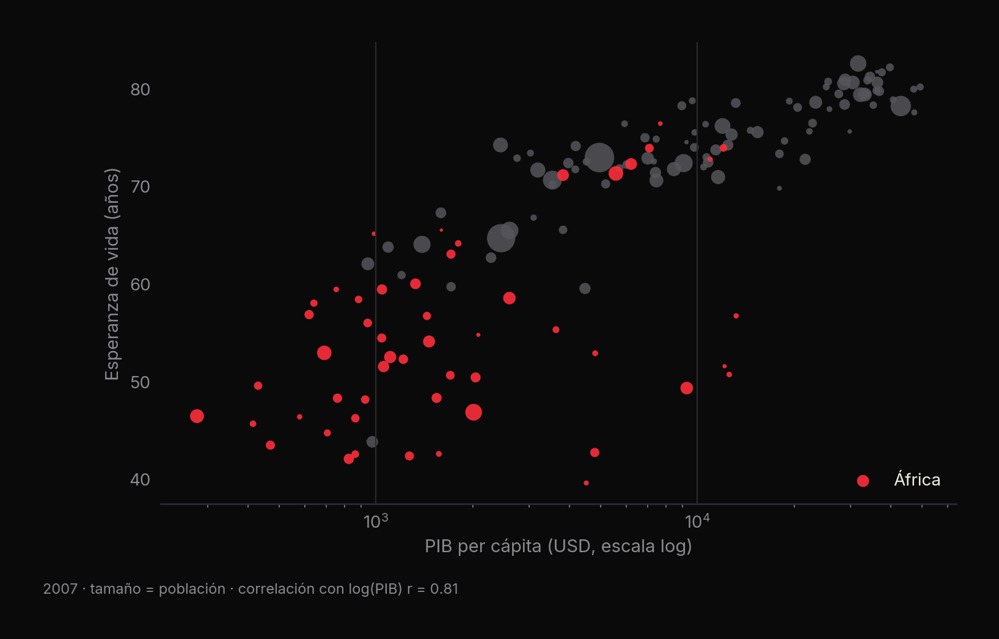

<p align="center"><a href="slides/esperanza_vida_deck.pdf"></a></p>

# 🌍 Esperanza de vida en el mundo

**Análisis descriptivo de 142 países entre 1952 y 2007: el promedio mundial sube 17.9 años, pero en 2007 aún hay 43 años de brecha** · Brandon Uriel García Sánchez

[](slides/esperanza_vida_deck.pdf) [](https://github.com/CatoXP/portfolio-data-science)   

## En resumen
- La esperanza de vida promedio pasó de **49.1 años (1952)** a **67.0 años (2007)**; la mediana subió todavía más: de **45.1 a 71.9**.
- En 2007 la brecha entre el país más longevo (**Japón, 82.6**) y el menos longevo (**Suazilandia, 39.6**) es de **43 años**.
- **África** (54.8 años en 2007) sigue muy por debajo de Europa (77.6) y Oceanía (80.7).

## 1. La pregunta
¿Cuánto ha cambiado la esperanza de vida en el mundo y qué tan desigual sigue siendo entre países y continentes?
Es un ejercicio de **estadística descriptiva** con Python: medidas de tendencia central, dispersión, cuartiles y
visualización.

## 2. Los datos
`esperanza-vida.csv` (dataset Gapminder): **1,704 filas** = 142 países × 12 mediciones (cada 5 años, de 1952 a 2007).

| Columna | Descripción |
|---|---|
| `country`, `continent` | País y continente |
| `year` | Año de la medición |
| `lifeExp` | Esperanza de vida al nacer (años) |
| `pop` | Población |
| `gdpPercap` | PIB per cápita (USD) |

No hay valores nulos, así que la limpieza consiste en verificarlo y conservar las 1,704 filas.

## 3. Metodología
1. Verificación de nulos y de la cobertura por año (142 países en cada año clave).
2. Selección de años clave cada 20 años: **1952, 1972, 1992 y 2007**.
3. Media, mediana, desviación estándar y cuartiles por año.
4. Top 5 y bottom 5 de países en 2007, y promedio por continente.
5. Visualizaciones: histogramas por año, evolución por continente y comparación de extremos.

## 4. Resultados

| Año | Media | Mediana | Desv. estándar |
|---|---|---|---|
| 1952 | 49.06 | 45.14 | 12.23 |
| 1972 | 57.65 | 56.53 | 11.38 |
| 1992 | 64.16 | 67.70 | 11.23 |
| 2007 | 67.01 | **71.94** | 12.07 |



La mediana sube más rápido que la media: la mayoría de los países avanzó, pero queda una cola de países rezagados
que jala el promedio hacia abajo.



| Mejor esperanza de vida (2007) | Años | Peor esperanza de vida (2007) | Años |
|---|---|---|---|
| Japón | 82.60 | Suazilandia | 39.61 |
| Hong Kong | 82.21 | Mozambique | 42.08 |
| Islandia | 81.76 | Zambia | 42.38 |
| Suiza | 81.70 | Sierra Leona | 42.57 |
| Australia | 81.24 | Lesoto | 42.59 |

**Análisis adicional (presentación):** en 2007 la esperanza de vida crece con el logaritmo del PIB per cápita
(r = 0.81). Duplicar el ingreso se asocia con ~5 años más de vida, sin importar el nivel de partida.



## 5. Lo que aprendí
- Comparar media y mediana revela la forma (y el sesgo) de una distribución.
- Una escala logarítmica cambia por completo la lectura del ingreso.
- Los promedios por continente esconden desigualdad interna.
- Verificar nulos y cobertura antes de comparar años.

## 6. Cómo reproducirlo
```bash
pip install pandas numpy matplotlib seaborn
jupyter notebook Analisis_Descriptivo_con_Python_Esperanza_de_vida.ipynb
```
> El notebook se escribió en Google Colab: cambia la ruta `/content/esperanza-vida.csv` por `esperanza-vida.csv`.

```
analisis-esperanza-vida/
├── Analisis_Descriptivo_con_Python_Esperanza_de_vida.ipynb
├── esperanza-vida.csv
└── slides/          presentación (PDF/PPTX), vista previa y gráficas
```

---
<sub>Parte de mi [portafolio de ciencia de datos](https://github.com/CatoXP/portfolio-data-science) · [LinkedIn](https://www.linkedin.com/in/brandon-uriel-garcia-sanchez-9ab77b320/) · [GitHub](https://github.com/CatoXP)</sub>
