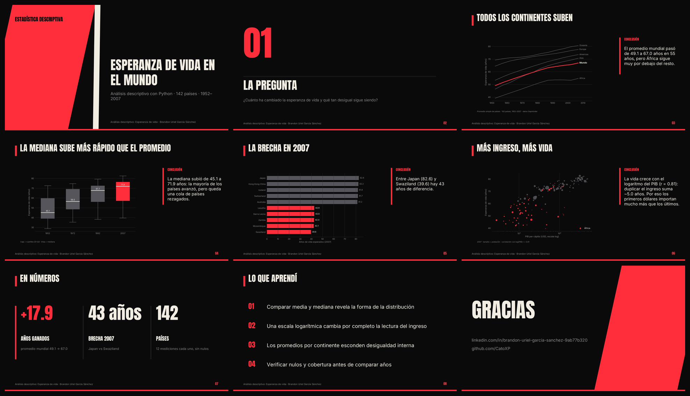

# Análisis Descriptivo: Esperanza de Vida

Análisis descriptivo de datos de esperanza de vida por país/región.

**Datos:** `esperanza-vida.csv`.
**Herramientas:** Python (pandas, estadística descriptiva).

## 📑 Presentación

**[Ver presentación en PDF](slides/esperanza_vida_deck.pdf)** · [Descargar PowerPoint](slides/esperanza_vida_deck.pptx) · 9 slides. Gráficas en [`slides/img/`](slides/img), todas con la identidad visual de mi [portafolio](https://github.com/CatoXP).
