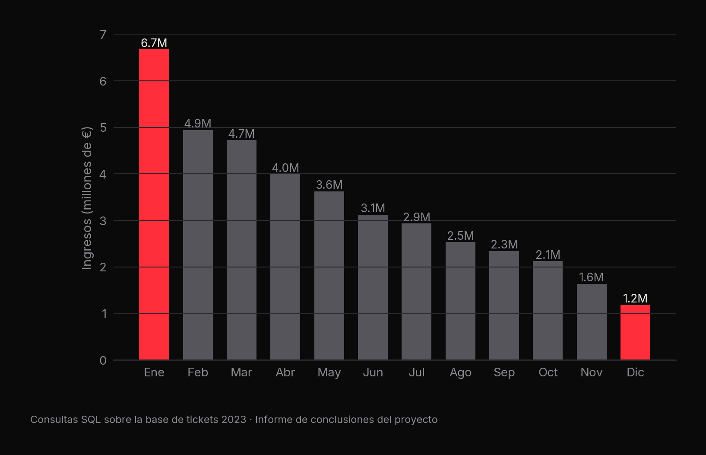
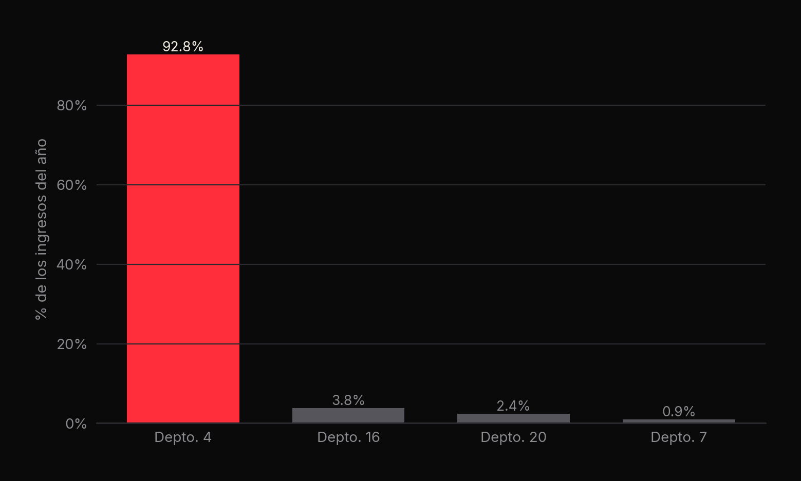
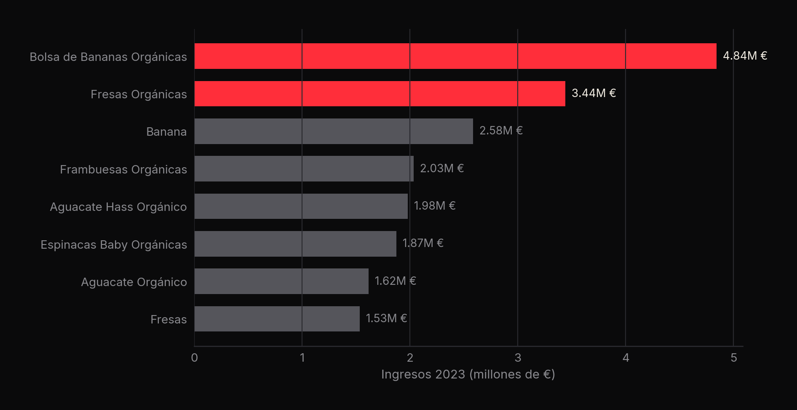
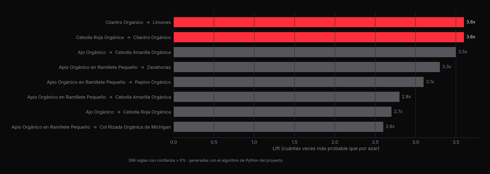

<p align="center"><a href="slides/retail_deck.pdf"></a></p>

# 🛒 Hábitos de consumo en retail digital

**SQL + reglas de asociación + Power BI para una tienda de comestibles en línea: €39.9M de ingresos, −82% de enero a diciembre** · Brandon Uriel García Sánchez

[](slides/retail_deck.pdf) [](https://github.com/CatoXP/portfolio-data-science)   

## En resumen
- Los ingresos del año suman **€39.85M**, pero caen **82%** entre enero (€6.67M) y diciembre (€1.18M).
- El **departamento 4 genera el 93%** de los ingresos y las secciones 24, 123 y 83 el 92%: hay mucha concentración.
- Ticket promedio de **€19.34** en **2,060,188 pedidos**. Las reglas de asociación (lift de hasta **3.6x**) son la base
  para recomendaciones que suban el ticket.

## 1. El reto
Una tienda de comestibles en línea quiere entender cómo compran sus clientes y qué hacer para subir el valor de cada
pedido. El proyecto cubre todo el flujo de un analista: consultas SQL, un algoritmo propio en Python y un dashboard
para negocio.

## 2. Qué hay en el proyecto
| Pieza | Contenido |
|---|---|
| **SQL** (`Base de datos SQL de la empresa/`) | Consultas de ventas por mes, departamento, sección, producto y cliente; ticket medio; informe de conclusiones para el consejo |
| **Python** (`Algoritmo_de_consumo_Python/`) | Algoritmo de reglas de asociación (soporte, confianza, lift) y su salida `outp_reglas_de_consumo.csv` (399 reglas) |
| **Power BI** (`Dashboard Power BI/`) | Documento de requerimientos funcionales de negocio, recursos visuales y maqueta de la tienda |

## 3. Hallazgos (consultas SQL)





| Indicador | Valor |
|---|---|
| Ingresos totales 2023 | €39,854,875.32 |
| Pedidos | 2,060,188 |
| Ticket promedio por pedido | €19.34 |
| Compra media por cliente | €219.09 |
| Producto con más ingresos | Bolsa de Bananas Orgánicas (€4.84M) |



## 4. Reglas de asociación (Python)
Cada pedido se convierte en un vector binario de productos y se calculan **soporte**, **confianza** y **lift** para cada
par (umbral de confianza: 5%). El algoritmo se explica a detalle en el proyecto
[Market Basket Analysis](../market-basket-consumo).



Quien compra cilantro orgánico tiene **3.6 veces** más probabilidad de llevar limones que un cliente cualquiera.

## 5. Recomendaciones para el negocio
1. Diversificar más allá del departamento 4 y de las secciones dominantes.
2. Ampliar la oferta con productos no orgánicos y menos populares.
3. Recomendaciones basadas en reglas de asociación para subir el ticket promedio.
4. Monitorear la caída mensual en un dashboard de Power BI.

## 6. Estructura
```
analisis-predictivo-consumo-retail/
├── Base de datos SQL de la empresa/   consultas, insights (xlsx) e informe de conclusiones (docx)
├── Algoritmo_de_consumo_Python/       notebook del algoritmo, documentación (PDF) y reglas (CSV)
├── Dashboard Power BI/                requerimientos funcionales, iconos y recursos del dashboard
└── slides/                            presentación (PDF/PPTX), vista previa y gráficas
```
> La base de datos original (`DBsanoyfresco.db`, SQLite) no se incluye en el repositorio.

---
<sub>Parte de mi [portafolio de ciencia de datos](https://github.com/CatoXP/portfolio-data-science) · [LinkedIn](https://www.linkedin.com/in/brandon-uriel-garcia-sanchez-9ab77b320/) · [GitHub](https://github.com/CatoXP)</sub>
