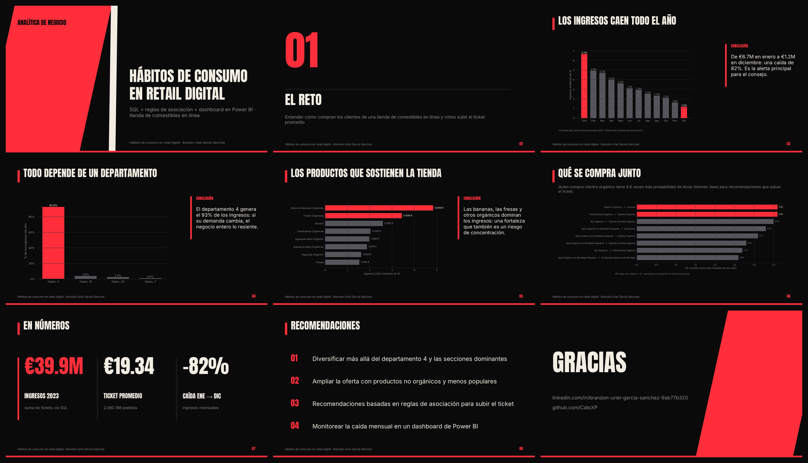

# Análisis Predictivo de Hábitos de Consumo para Impulso de Ventas en Retail Digital

Análisis de datos de una tienda de comestibles para identificar patrones de consumo y generar reglas de asociación (market basket) que impulsen las ventas. Incluye limpieza y consultas en SQL, un algoritmo de reglas de consumo en Python y un dashboard en Power BI con los insights para negocio.

**Datos:** base de datos SQL de ventas de la tienda.
**Herramientas:** Python (reglas de asociación), SQL, Power BI.

## 📑 Presentación

**[Ver presentación en PDF](slides/retail_deck.pdf)** · [Descargar PowerPoint](slides/retail_deck.pptx) · 9 slides. Gráficas en [`slides/img/`](slides/img), todas con la identidad visual de mi [portafolio](https://github.com/CatoXP).
