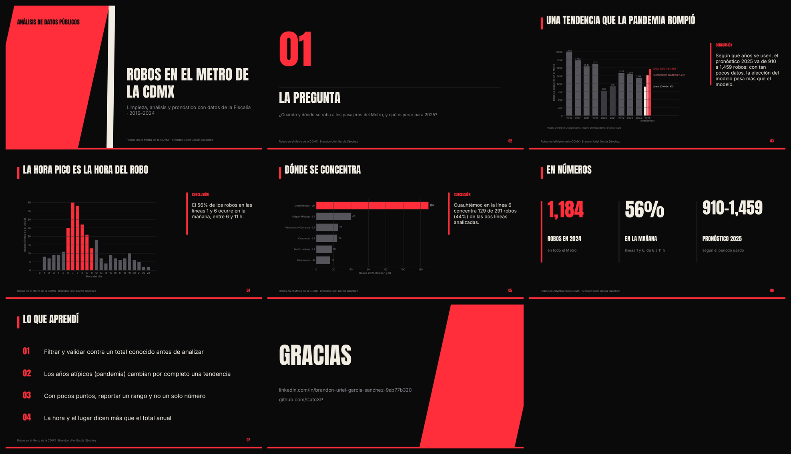
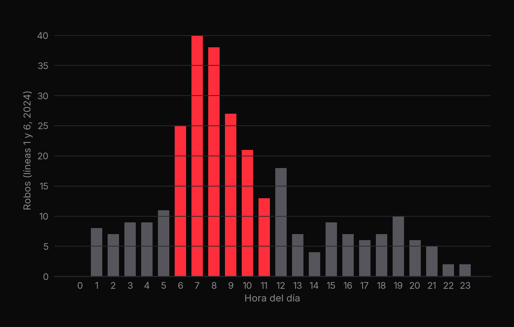
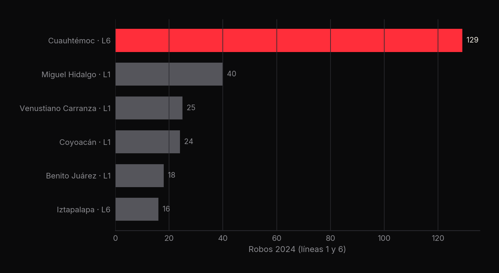
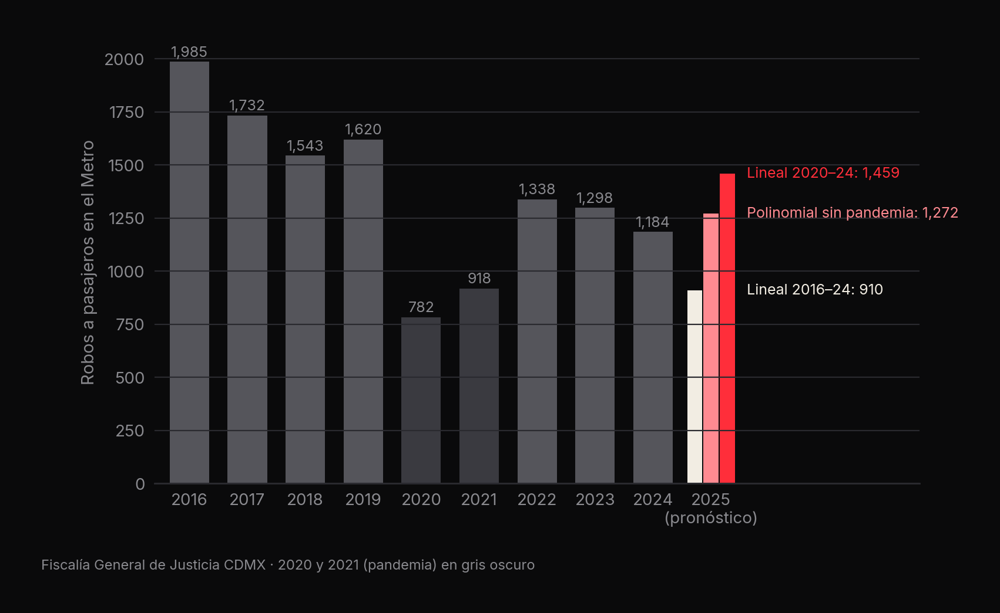

<p align="center"><a href="slides/metro_cdmx_deck.pdf"></a></p>

# 🚇 Robos en el Metro de la CDMX

**Datos abiertos de la Fiscalía: el 56% de los robos en las líneas 1 y 6 ocurre en la mañana, y el pronóstico 2025 va de 910 a 1,459 según el modelo** · Brandon Uriel García Sánchez

[](slides/metro_cdmx_deck.pdf) [](https://github.com/CatoXP/portfolio-data-science)   

## En resumen
- En 2024 hubo **1,184 robos a pasajeros** a bordo del Metro (Fiscalía General de Justicia CDMX).
- En las líneas 1 y 6 (291 robos), el **56% ocurre en la mañana (6 a 11 h)** y la zona de **Cuauhtémoc en la línea 6
  concentra 129 (44%)**.
- Tres modelos pronostican para 2025 entre **910 y 1,459 robos**, según qué años se usen: con tan pocos datos y una
  pandemia en medio, conviene reportar un rango.

## 1. La pregunta
¿Cuándo y dónde se roba a los pasajeros del Metro, y qué esperar para 2025?

## 2. Los datos
| Archivo | Contenido |
|---|---|
| `1A DELITOS(2024).csv` | Carpetas de investigación 2024 de la Fiscalía CDMX (todas las categorías) |
| `1A DELITOS DATOS LIMPIOS.csv/.xlsx` | Los 1,184 robos a pasajeros del Metro en 2024 (1,146 sin violencia, 38 con violencia) |
| `(2020 - 2024).csv` | Total anual de robos a pasajeros 2020–2024 |
| `Incidentes de Robo en el Metro de la CDMX.kmz` | Coordenadas de los incidentes para mapa |
| `Analisis de datos Fiscalia 2020 - 2025.pbix` | Dashboard en Power BI |

## 3. Metodología
1. **Limpieza y validación:** filtrar `ROBO A PASAJERO A BORDO DEL METRO CON Y SIN VIOLENCIA` y comprobar el total
   conocido (1,184) con un `assert` antes de analizar.
2. **Líneas 1 y 6:** a partir del código de zona (`CT HECHOS`), conteo por zona, por hora y por periodo del día.
3. **Pronóstico** (`Regresion_Lineal.ipynb`): regresión lineal 2016–2024, regresión lineal 2020–2024 y regresión
   polinomial de grado 2 sin los años atípicos 2019–2021.

## 4. Resultados



| Periodo | Robos (L1 y L6) |
|---|---|
| Madrugada (0–5 h) | 44 |
| **Mañana (6–11 h)** | **164** |
| Tarde (12–17 h) | 51 |
| Noche (18–23 h) | 32 |





| Modelo | Años usados | Pronóstico 2025 |
|---|---|---|
| Regresión lineal | 2016–2024 | 910 |
| Regresión polinomial (grado 2) | 2016–2024 sin 2019–2021 | 1,272 |
| Regresión lineal | 2020–2024 | 1,459 |

## 5. Lo que aprendí
- Filtrar y validar contra un total conocido antes de analizar.
- Los años atípicos (pandemia) cambian por completo una tendencia.
- Con pocos puntos, reportar un rango y no un solo número.
- La hora y el lugar dicen más que el total anual.

## 6. Cómo reproducirlo
```bash
pip install pandas matplotlib scikit-learn
jupyter notebook Limpieza_de_datos_y_Analisis_de_datos_MetroCDMX.ipynb
jupyter notebook Regresion_Lineal.ipynb
```
> El CSV de la Fiscalía viene en codificación latin-1: `pd.read_csv(..., encoding="latin-1")`.

---
<sub>Parte de mi [portafolio de ciencia de datos](https://github.com/CatoXP/portfolio-data-science) · [LinkedIn](https://www.linkedin.com/in/brandon-uriel-garcia-sanchez-9ab77b320/) · [GitHub](https://github.com/CatoXP)</sub>
