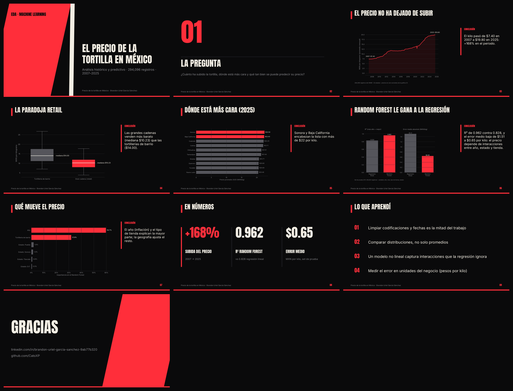
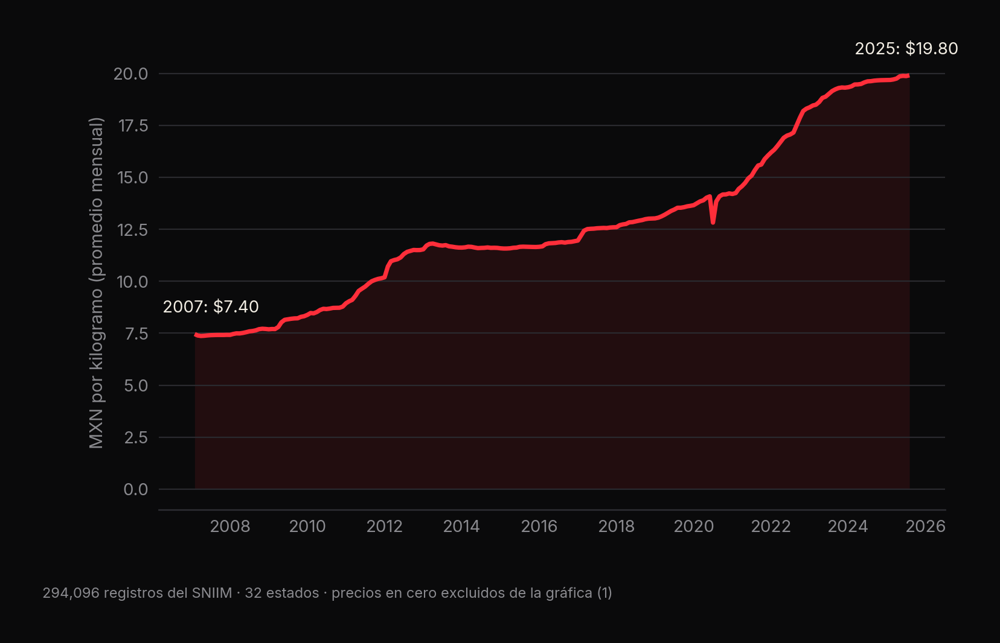
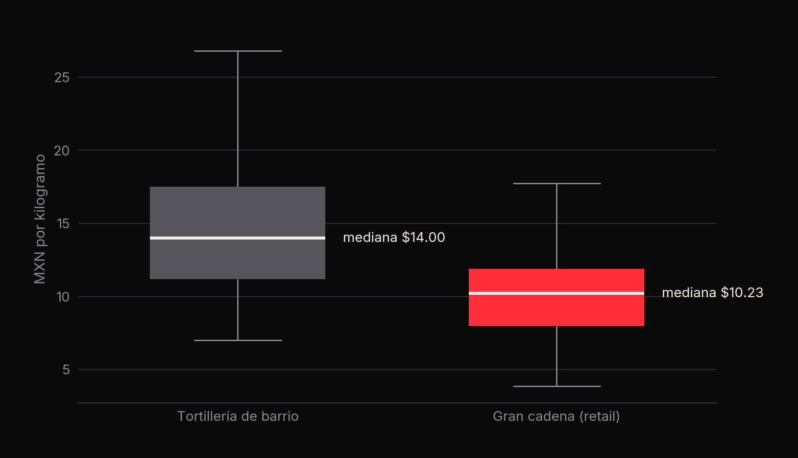
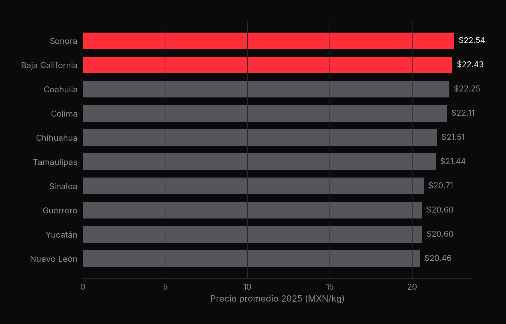
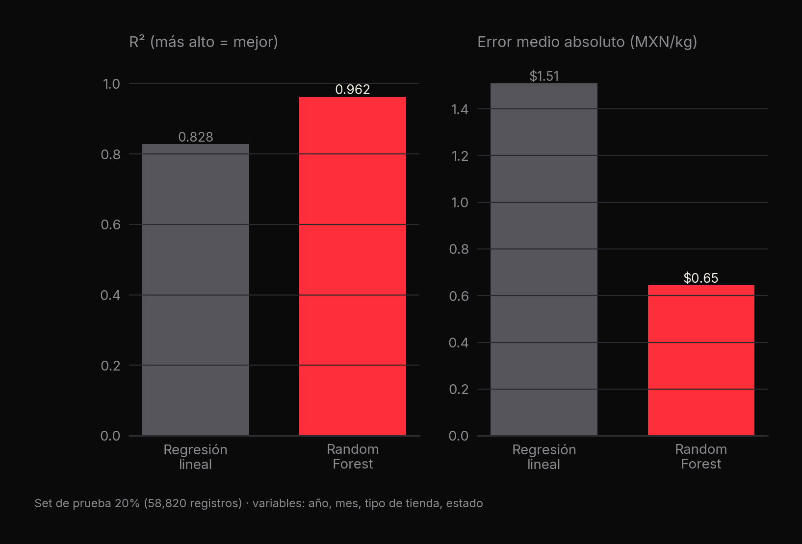
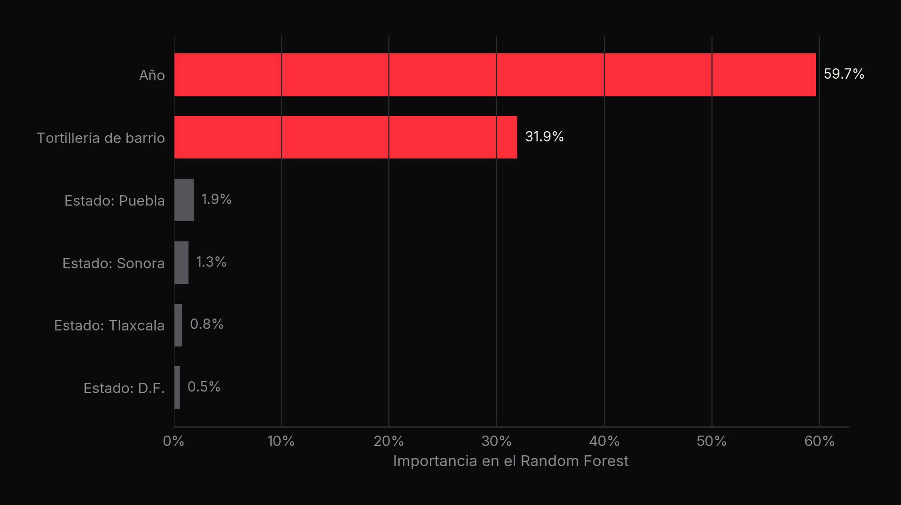

<p align="center"><a href="slides/tortillas_deck.pdf"></a></p>

# 🌽 El precio de la tortilla en México

**294,096 registros del SNIIM (2007–2025): el kilo sube 168% y un Random Forest predice el precio con R² de 0.962** · Brandon Uriel García Sánchez

[](slides/tortillas_deck.pdf) [](https://github.com/CatoXP/portfolio-data-science)    

## En resumen
- El precio promedio del kilo pasó de **$7.40 (2007)** a **$19.80 (2025)**: **+168%**.
- **La paradoja retail:** las grandes cadenas venden más barato (mediana **$10.23/kg**) que las tortillerías de barrio
  (**$14.00/kg**).
- **Random Forest** (R² **0.962**, error medio **$0.65/kg**) supera a la regresión lineal (R² 0.828, $1.51/kg): el
  precio depende de interacciones entre año, estado y tipo de tienda.

## 1. La pregunta
¿Cuánto ha subido la tortilla, dónde está más cara y qué tan bien se puede predecir su precio?

## 2. Los datos
`tortilla_prices.csv` — Sistema Nacional de Información e Integración de Mercados (SNIIM): **300,486 registros**
diarios con estado, ciudad, fecha, tipo de tienda y precio por kilogramo. Tras la limpieza quedan **294,096**.

## 3. Metodología
1. **Limpieza:** espacios de no-ruptura (`\xa0`) en estados y ciudades, precios no numéricos, construcción de la fecha y
   orden cronológico.
2. **EDA:** evolución mensual del precio, comparación de distribuciones por tipo de tienda y estados más caros en 2025.
3. **Modelos:** regresión lineal vs Random Forest (50 árboles, profundidad 15) con año, mes, tipo de tienda y estado
   (*one-hot*), 80/20 train/test.

## 4. Resultados







| Modelo | R² | MAE (MXN/kg) | RMSE (MXN/kg) |
|---|---|---|---|
| Regresión lineal | 0.8276 | 1.51 | 2.03 |
| **Random Forest** | **0.9623** | **0.65** | **0.95** |



El año (inflación) y el tipo de tienda explican la mayor parte del precio; la geografía ajusta el resto.



## 5. Lo que aprendí
- Limpiar codificaciones y fechas es la mitad del trabajo.
- Comparar distribuciones, no solo promedios.
- Un modelo no lineal captura interacciones que la regresión ignora.
- Medir el error en unidades del negocio (pesos por kilo).

## 6. Cómo reproducirlo
```bash
pip install pandas numpy scikit-learn matplotlib seaborn plotly
jupyter notebook Analisis_Tortillas.ipynb
```

---
<sub>Parte de mi [portafolio de ciencia de datos](https://github.com/CatoXP/portfolio-data-science) · [LinkedIn](https://www.linkedin.com/in/brandon-uriel-garcia-sanchez-9ab77b320/) · [GitHub](https://github.com/CatoXP)</sub>
