# 🏦 Home Credit Default Risk — Competencia GCI World 2026 · The University of Tokyo

**Participación en la competencia de ML de GCI World 2026** · ROC-AUC **0.77434** en el leaderboard público · Brandon Uriel Garcia Sanchez

[](https://github.com/CatoXP)
[](https://www.linkedin.com/in/brandon-uriel-garcia-sanchez-9ab77b320/)


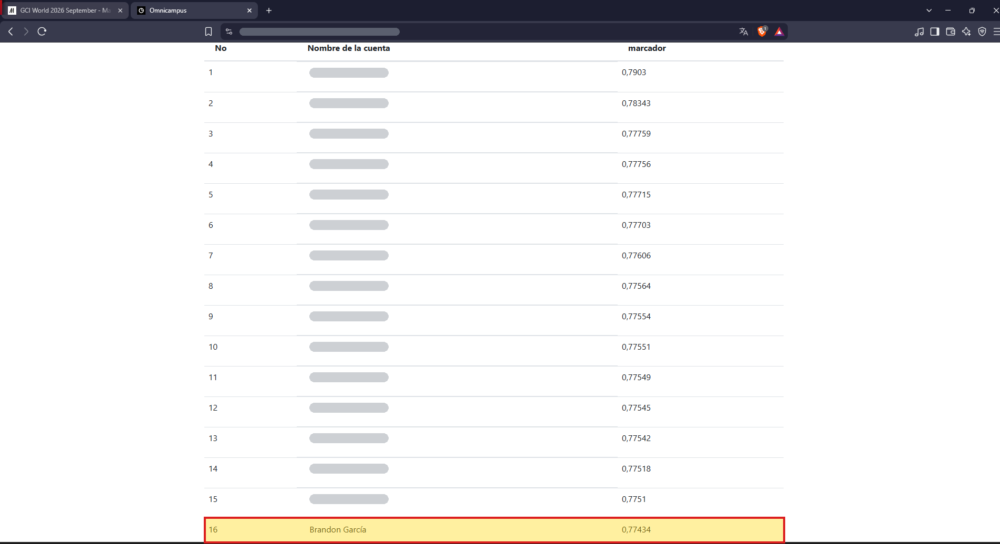

📑 **Presentación del proyecto:** [slides/home_credit_deck.pdf](slides/home_credit_deck.pdf)

<p align="center"><a href="slides/home_credit_deck.pdf">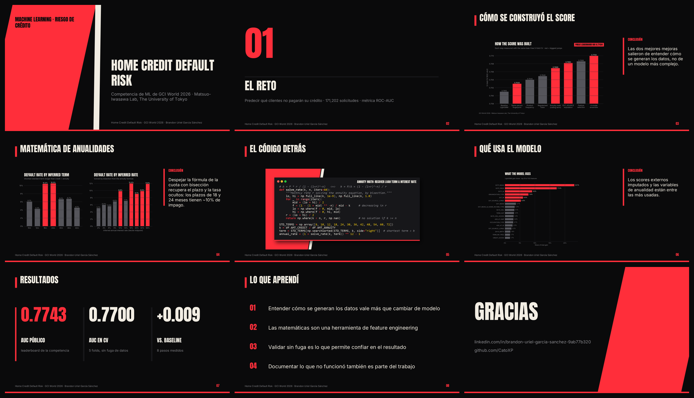</a></p>

## Índice
1. [¿Por qué existe este proyecto?](#1-por-qué-existe-este-proyecto)
2. [El problema](#2-el-problema)
3. [Los datos](#3-los-datos)
4. [Metodología de validación](#4-metodología-de-validación-sin-fuga-de-datos)
5. [Análisis exploratorio](#5-análisis-exploratorio)
6. [Feature engineering](#6-feature-engineering)
7. [Modelos y ensamble](#7-modelos-y-ensamble)
8. [Resultados](#8-resultados)
9. [Lo que no funcionó](#9-lo-que-no-funcionó)
10. [Conclusiones y aprendizajes](#10-conclusiones-y-aprendizajes)
11. [Cómo reproducirlo](#11-cómo-reproducirlo)

---

## 1. ¿Por qué existe este proyecto?

**GCI (Global Consumer Intelligence)** es el programa de Data Science e Inteligencia Artificial del
[**Matsuo-Iwasawa Laboratory de The University of Tokyo**](https://weblab.t.u-tokyo.ac.jp/en/lecture/gci/). Se imparte en Japón
desde 2014 y su edición internacional, **GCI World**, reúne a miles de estudiantes de alrededor de 100 países
([fuente](https://weblab.t.u-tokyo.ac.jp/en/news/2026-07-27-2en/)). Cubre Python, machine learning, SQL y aplicaciones de IA a negocio.

Como parte del curso (edición septiembre 2026) se organizó una **competencia interna de Machine Learning**. Para obtener el
reconocimiento **Honors / Outstanding Student** hay que quedar en el **top 20%** del ranking final y entregar un notebook que
reproduzca exactamente la predicción enviada. Este repositorio es ese notebook, documentado de inicio a fin.

| Dato | Valor |
|---|---|
| Organiza | Matsuo-Iwasawa Lab, The University of Tokyo |
| Plataforma de envío | Omnicampus |
| Periodo | 2 de octubre – 20 de noviembre de 2026 |
| Métrica | ROC-AUC |
| Ranking | Leaderboard público (parte del test) durante la competencia; ranking privado (test completo) al cierre |

## 2. El problema

Home Credit presta dinero a personas con poco o ningún historial crediticio. El objetivo es **estimar la probabilidad de que un
cliente tenga dificultades para pagar su crédito** (`TARGET = 1`) con la información de su solicitud. Una buena estimación permite
aprobar a más clientes buenos sin aumentar el riesgo.

Como la métrica es **ROC-AUC**, lo importante no es la probabilidad exacta sino **ordenar** bien a los clientes del más al menos
riesgoso.

## 3. Los datos

Es una versión modificada de la competencia de Kaggle
[**Home Credit Default Risk**](https://www.kaggle.com/competitions/home-credit-default-risk). A diferencia del original, que tenía
7 tablas, aquí **solo hay una tabla** con la solicitud de crédito:

| Archivo | Filas | Columnas |
|---|---|---|
| `train.csv` | 171,202 | 32 variables + `SK_ID_CURR` + `TARGET` |
| `test.csv` | 61,500 | 32 variables + `SK_ID_CURR` |

Hay variables de demografía (edad, género, familia, educación), empleo (tipo de ingreso, ocupación, organización), del crédito
(monto, cuota, precio del bien) y tres scores externos (`EXT_SOURCE_1/2/3`). Solo el **8.07%** de los clientes cae en impago.

> ⚠️ **Los datos no se incluyen en el repo.** Son material del curso y derivan de una competencia de Kaggle cuyas reglas no permiten
> redistribuirlos. Ver la [sección 11](#11-cómo-reproducirlo) para reproducir el proyecto.

## 4. Metodología de validación (sin fuga de datos)

Todo se decidió con **validación cruzada estratificada de 5 folds**, nunca mirando el leaderboard público. Este solo usa una parte
del test, y con ~1,500 casos positivos su ruido es de **±0.004** de AUC, más que muchas de las mejoras que se evalúan.

Reglas que se cumplen en todo el proyecto:
- Las variables que usan `TARGET` se **recalculan dentro de cada fold** solo con las etiquetas de entrenamiento de ese fold.
- Una fila **nunca ve su propia etiqueta** (leave-one-out).
- Los modelos de imputación **nunca ven `TARGET`**.

El resultado lo confirma: **CV 0.7700 → leaderboard público 0.7743**, sin sobreajuste.

## 5. Análisis exploratorio

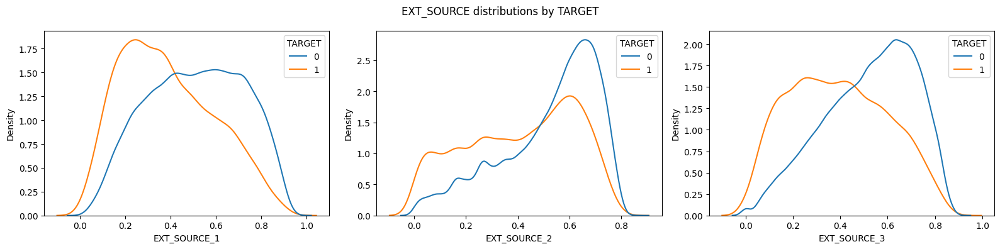

- Los **scores externos** son, por mucho, las variables más predictivas. Pero `EXT_SOURCE_1` falta en el **70%** de los clientes y
  `EXT_SOURCE_3` en el **32%**.
- `DAYS_EMPLOYED = 365243` es un marcador falso (pensionados y desempleados) → se trata como faltante. `OWN_CAR_AGE ≥ 60` y `CODE_GENDER = XNA` también.
- Los créditos *revolving* siempre tienen una cuota igual al 5% del límite.

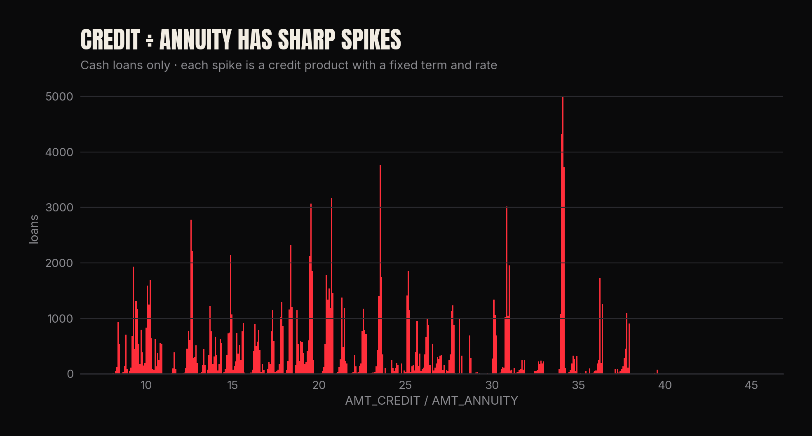

El cociente **crédito / cuota** de los créditos en efectivo tiene **picos muy marcados** y una relación no monótona con el impago.
Eso apunta a que cada pico es un producto de crédito con plazo y tasa fijos, y esa intuición dio la mejor variable del proyecto.

## 6. Feature engineering

### 6.1 Variables de dominio
Cocientes como cuota/ingreso, crédito/ingreso, crédito/precio del bien (seguro o enganche) e ingreso por persona. Agregados de los
scores externos (media, mínimo, máximo, producto y promedio ponderado). Valores relativos al grupo (por ejemplo, el ingreso del
cliente contra la mediana de su ocupación) y *count encoding* de las categorías.

### 6.2 Matemática de anualidades: plazo y tasa de interés ocultos (+0.003 AUC)
El dataset trae el monto $P$ y la cuota mensual $A$, pero **no el plazo ni la tasa**. La fórmula de anualidades dice

$$A = P\,\frac{r}{1-(1+r)^{-n}} \iff k = \frac{P}{A} = \frac{1-(1+r)^{-n}}{r}$$

Para un plazo $n$ dado, el lado derecho es **estrictamente decreciente** en $r$ y vale $n$ cuando $r \to 0$. Por eso existe una tasa
no negativa **si y solo si $k < n$**, y es única. Se encuentra por **bisección** (60 iteraciones).

El plazo se infiere como el **plazo estándar más corto mayor que $k$** (6, 10, 12, 18, 24, 30, 36… meses), y así aparecen productos
reales: $k = 34.2 \Rightarrow$ 36 meses al **3.4%** anual (promoción); $k = 20.46 \Rightarrow$ 24 meses al **17%**;
$k = 10.2 \Rightarrow$ 12 meses al **36%**. De ahí salen la tasa, el plazo, el interés total pagado y el interés relativo al ingreso.
Un árbol no puede aprender esto solo a partir de $k$, porque depende de una cuadrícula discreta de plazos.

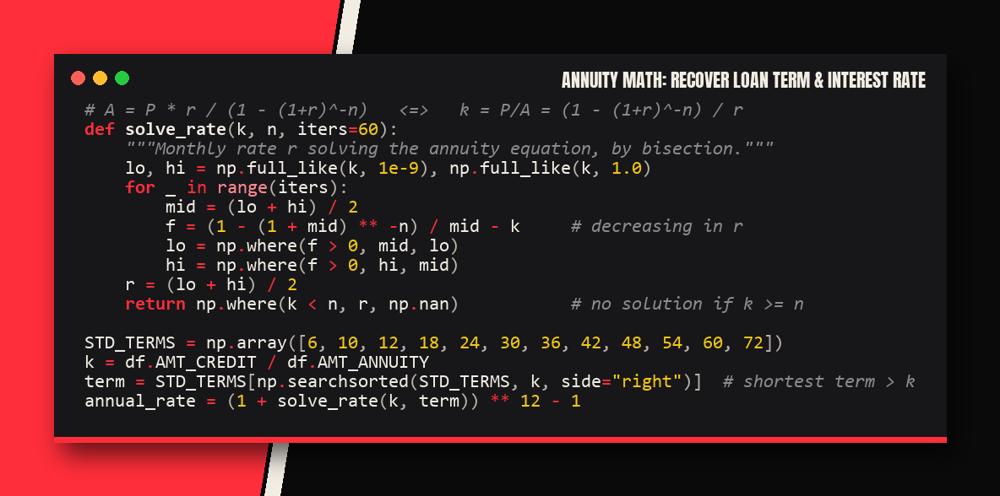
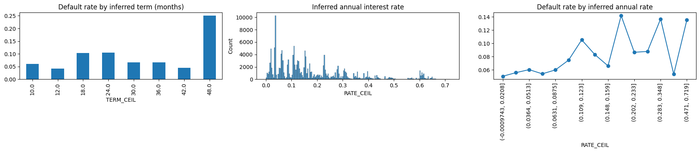

### 6.3 Huella de "misma persona" (+0.002 AUC)
Las variables `DAYS_*` se cuentan **hacia atrás desde la fecha de la solicitud**, pero sus **diferencias no cambian**: la edad del
cliente cuando se emitió su identificación (`DAYS_BIRTH − DAYS_ID_PUBLISH`) o cuando se registró. Junto con el género forman una
huella que identifica **otras solicitudes de la misma persona** (~3% de las filas):

| Si la otra solicitud de esa persona… | Probabilidad de impago |
|---|---|
| cayó en impago | **25% – 44%** |
| se pagó bien | **5%** |

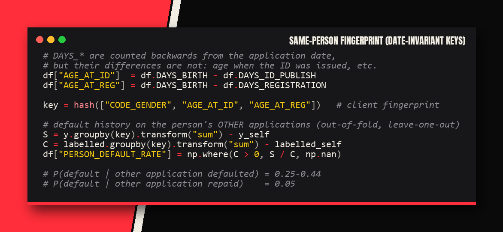

### 6.4 Imputación de los scores externos con modelos (+0.0013 AUC)
`EXT_SOURCE_1` es en parte predecible (**R² = 0.48**) a partir de la edad, el empleo y los otros scores. Un regresor LightGBM
(5-fold, **sin ver `TARGET`**) predice cada score, y se agregan la predicción, el valor completado y sus agregados.

### 6.5 Selección de variables
Con la importancia (ganancia) sumada sobre los 5 folds se quitaron las **15 variables menos útiles** (codificaciones redundantes y
conteos duplicados): 103 variables finales.

## 7. Modelos y ensamble

| Modelo | Configuración | AUC (CV) |
|---|---|---|
| LightGBM | 15 hojas, ≥200 filas por hoja, 40% de columnas por árbol, 3 semillas | 0.7690 |
| LightGBM-B | 31 hojas, 25% de columnas, más regularización | 0.7686 |
| XGBoost | profundidad 4, categorías nativas | 0.7686 |
| CatBoost | árboles simétricos, *ordered target statistics* | 0.7675 |

Los árboles **pequeños y muy regularizados** funcionaron mejor que los grandes. **Optuna** no superó el ajuste manual.

**Ensamble:** como el AUC solo depende del orden, se mezclan **rankings normalizados** con pesos $w \ge 0,\ \sum w = 1$ que
maximizan el AUC out-of-fold (Nelder–Mead). CatBoost es el modelo menos correlacionado con los demás (0.97), así que recibe mucho peso.

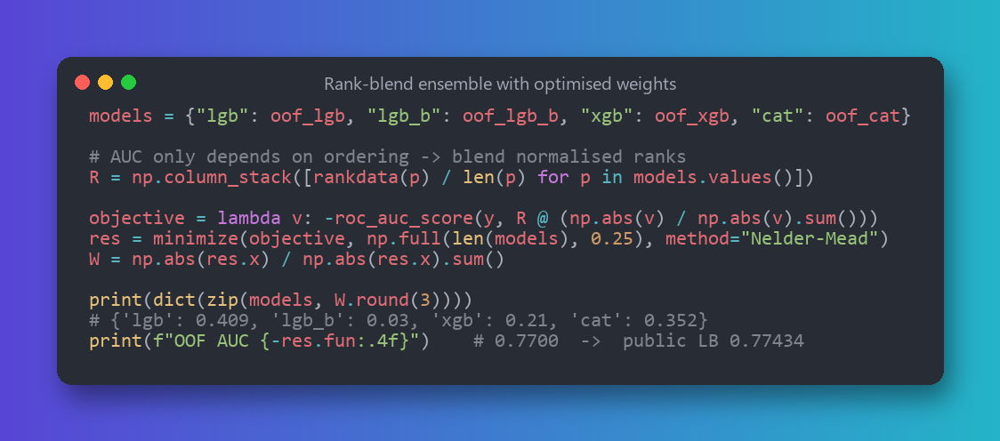

<p align="center">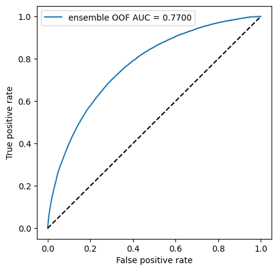 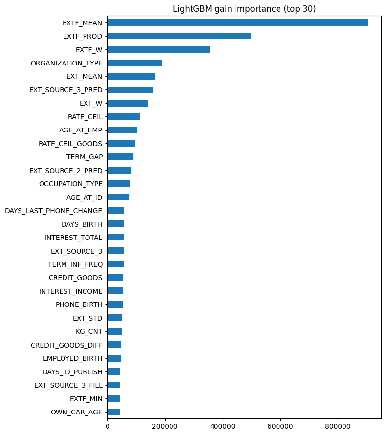</p>

## 8. Resultados

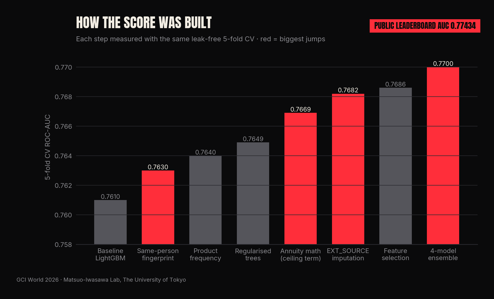

| # | Paso | AUC (CV, 5 folds) |
|---|---|---|
| 1 | LightGBM + variables de dominio | 0.7610 |
| 2 | + huella de "misma persona" | 0.7630 |
| 3 | + producto de crédito más frecuente | 0.7640 |
| 4 | árboles pequeños y regularizados | 0.7649 |
| 5 | + plazo techo y tasa por bisección | 0.7669 |
| 6 | + imputación de EXT_SOURCE | 0.7682 |
| 7 | selección de variables | 0.7686 |
| 8 | **ensamble de 4 modelos** | **0.7700** |
| | **Leaderboard público (Omnicampus)** | **0.77434** |

## 9. Lo que no funcionó
Probar ideas que fallan también es parte del trabajo. Todas se midieron con el mismo CV:

| Idea | Resultado |
|---|---|
| Media del target de los 300 vecinos más cercanos (KNN) | −0.0003 |
| Más llaves de "misma persona" o sus agregados | dentro del ruido |
| Optuna (TPE, 12 trials) | no superó el ajuste manual |
| Tasa del plazo siguiente | −0.0002 |
| Residuales (score real − imputado) | +0.00003 |
| Target encoding de pares de categorías | +0.0001 |
| LightGBM DART | peso 0 en el ensamble |
| Red neuronal (MLP con embeddings) + 2ª CatBoost | +0.0002, no vale la complejidad |

También se revisaron posibles fugas (orden de los IDs, duplicados exactos o casi exactos entre train y test) y **no hay ninguna**.

## 10. Conclusiones y aprendizajes
- **Entender el problema vale más que cambiar de modelo.** Las dos mejores mejoras vinieron de pensar cómo se generan los datos
  (la fórmula de las cuotas y quién es la misma persona), no de un algoritmo más complejo.
- **Las matemáticas son una herramienta de feature engineering:** despejar una ecuación con bisección recuperó información que no
  venía en el dataset.
- **Una validación rigurosa es lo que permite confiar en los resultados.** Con un CV sin fuga, el score del leaderboard (0.774) fue
  consistente con el CV (0.770).
- La diversidad de modelos aporta más que afinar uno solo: el ensamble subió +0.001 sobre el mejor modelo individual.

## 11. Cómo reproducirlo

1. Consigue los datos: los del curso (carpeta `input/` de GCI World con `train.csv`, `test.csv` y `sample_submission.csv`), o la
   tabla `application_train.csv` original de [Kaggle](https://www.kaggle.com/competitions/home-credit-default-risk/data). La original
   tiene más columnas y filas, así que hay que adaptar la carga.
2. Coloca la carpeta `input/` junto al notebook.
3. Ejecuta:

```bash
pip install -r requirements.txt
jupyter notebook home_credit_solution.ipynb   # Run All: ~30 min con 12 CPUs, ~1-1.5 h en Colab
```

El notebook genera `output/submission.csv`. Funciona en local y en Google Colab (ajusta la ruta en la celda `%cd`).

```
home-credit-default-risk-gci-utokyo/
├── home_credit_solution.ipynb   notebook completo con outputs (EDA → features → modelos → ensamble → envío)
├── images/                      gráficas, capturas de código y leaderboard
├── slides/                     presentación del proyecto (PDF, 9 slides) y vista previa
├── requirements.txt
└── README.md
```

---
*Proyecto realizado en la competencia del programa GCI World 2026 (septiembre) del Matsuo-Iwasawa Laboratory, The University of Tokyo.*
