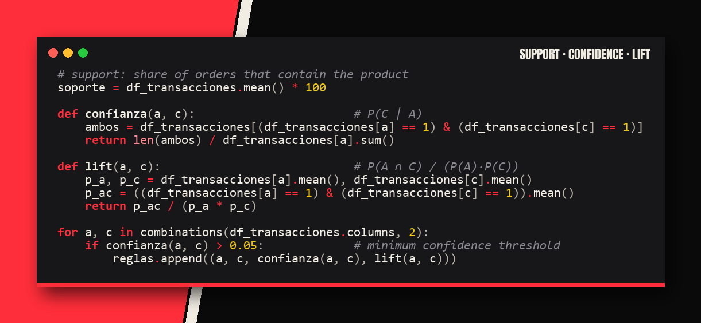
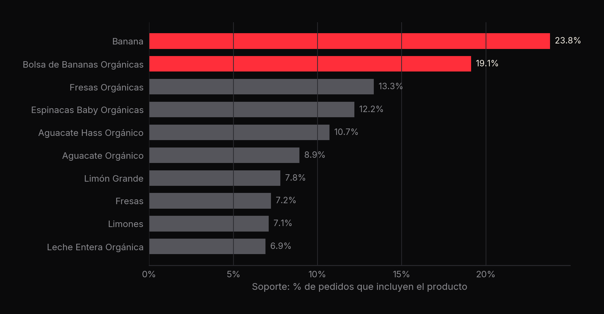
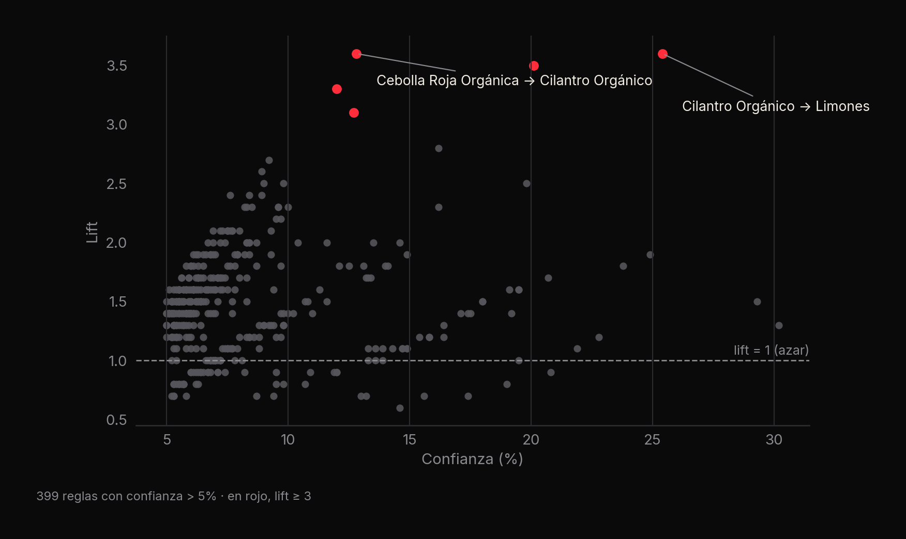

<p align="center"><a href="slides/market_basket_deck.pdf"></a></p>

# 🧺 Market Basket Analysis

**Algoritmo de reglas de asociación implementado desde cero con pandas: 399 reglas, lift máximo de 3.6x** · Brandon Uriel García Sánchez

[](slides/market_basket_deck.pdf) [](https://github.com/CatoXP/portfolio-data-science)   

## En resumen
- Implementa a mano las tres medidas del *market basket analysis* —**soporte, confianza y lift**— sin librerías de
  reglas de asociación.
- Genera **399 reglas** con confianza mayor a 5%; la más fuerte (**Cebolla Roja Orgánica → Cilantro Orgánico**) se
  compra junta **3.6 veces** más que por azar.
- El producto más frecuente (la banana) aparece en el **23.8%** de los pedidos.

## 1. La idea
Si un cliente compra A, ¿qué tan probable es que también compre B? Responderlo permite recomendar productos, armar
promociones y acomodar el catálogo.

| Medida | Fórmula | Qué dice |
|---|---|---|
| Soporte | $P(A)$ | % de pedidos que incluyen el producto |
| Confianza | $P(B \mid A) = \dfrac{P(A \cap B)}{P(A)}$ | De quienes compran A, cuántos llevan B |
| Lift | $\dfrac{P(A \cap B)}{P(A)\,P(B)}$ | > 1: se compran juntos más que por azar |

## 2. Cómo funciona
1. Lectura de los tickets desde SQLite (`tickets`: pedido, cliente, fecha, producto…).
2. Agrupación por pedido y *one-hot encoding* con `str.get_dummies`: una fila por pedido, una columna por producto.
3. Soporte de cada producto (media de cada columna).
4. Para cada par de productos (`itertools.combinations`), confianza y lift; se conservan las reglas con confianza > 5%.
5. Orden por lift y exportación a CSV, enriquecida con sección y departamento de cada producto.



## 3. Resultados





Ordenar por **lift** y no por confianza evita las reglas obvias: un producto muy popular tiene confianza alta con casi
todo, pero lift cercano a 1.

## 4. Lo que aprendí
- Implementar la matemática a mano antes de usar una librería.
- Ordenar por lift y no por confianza evita reglas obvias.
- Transformar tickets en una matriz binaria con `get_dummies`.
- Las reglas alimentan el caso de negocio del proyecto de [retail](../analisis-predictivo-consumo-retail).

## 5. Cómo reproducirlo
```bash
pip install pandas
jupyter notebook "Algoritmo de consumo Market Basket Analyst.ipynb"
```
> El notebook lee la base `DBsanoyfresco.db` (SQLite), que no se incluye en el repositorio. Las reglas resultantes están
> en [`../analisis-predictivo-consumo-retail/Algoritmo_de_consumo_Python/outp_reglas_de_consumo.csv`](../analisis-predictivo-consumo-retail/Algoritmo_de_consumo_Python/outp_reglas_de_consumo.csv).

---
<sub>Parte de mi [portafolio de ciencia de datos](https://github.com/CatoXP/portfolio-data-science) · [LinkedIn](https://www.linkedin.com/in/brandon-uriel-garcia-sanchez-9ab77b320/) · [GitHub](https://github.com/CatoXP)</sub>
