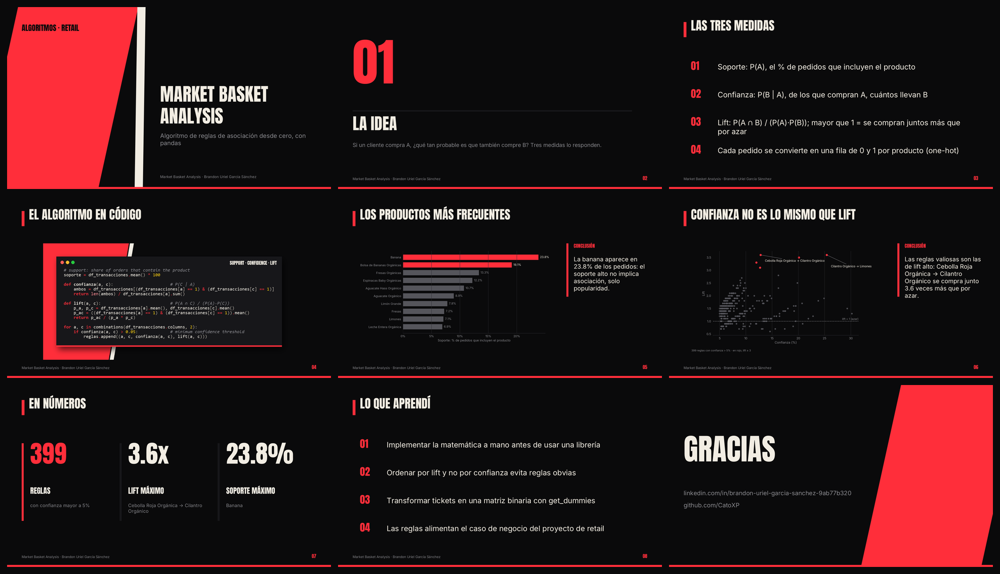

# Algoritmo de Consumo (Market Basket Analysis)

Algoritmo de reglas de asociación (market basket analysis) para identificar qué productos se compran juntos con más frecuencia.

**Herramientas:** Python (reglas de asociación).

## 📑 Presentación

**[Ver presentación en PDF](slides/market_basket_deck.pdf)** · [Descargar PowerPoint](slides/market_basket_deck.pptx) · 9 slides. Gráficas en [`slides/img/`](slides/img), todas con la identidad visual de mi [portafolio](https://github.com/CatoXP).
